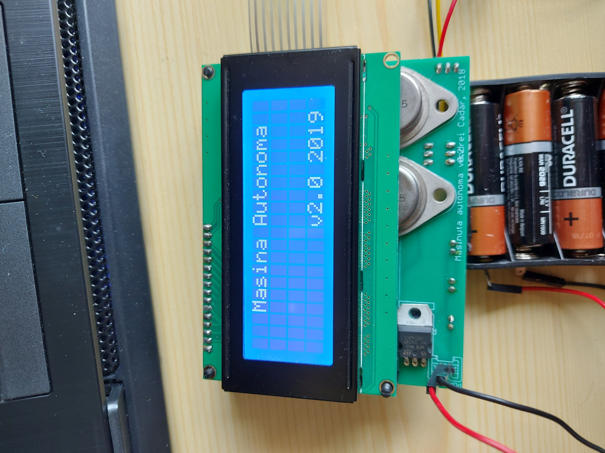
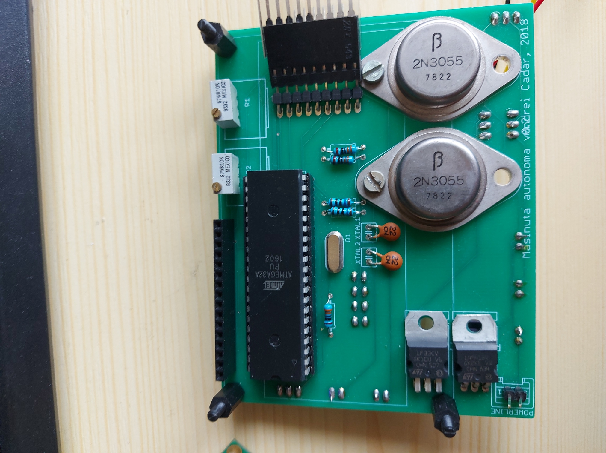
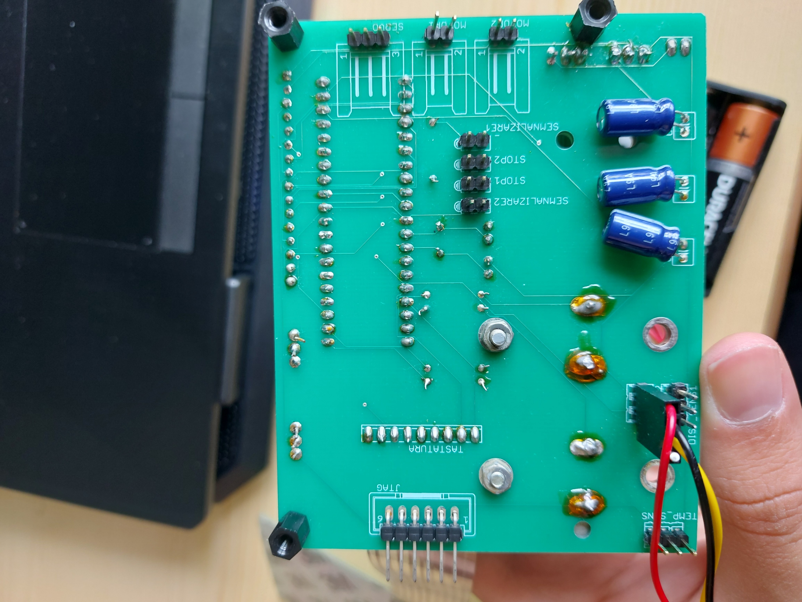
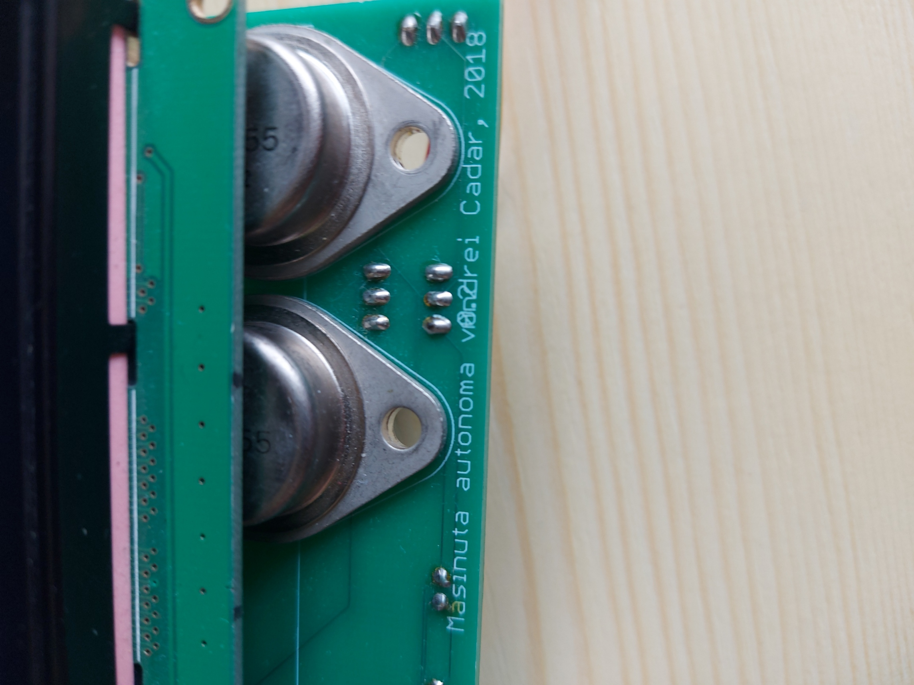
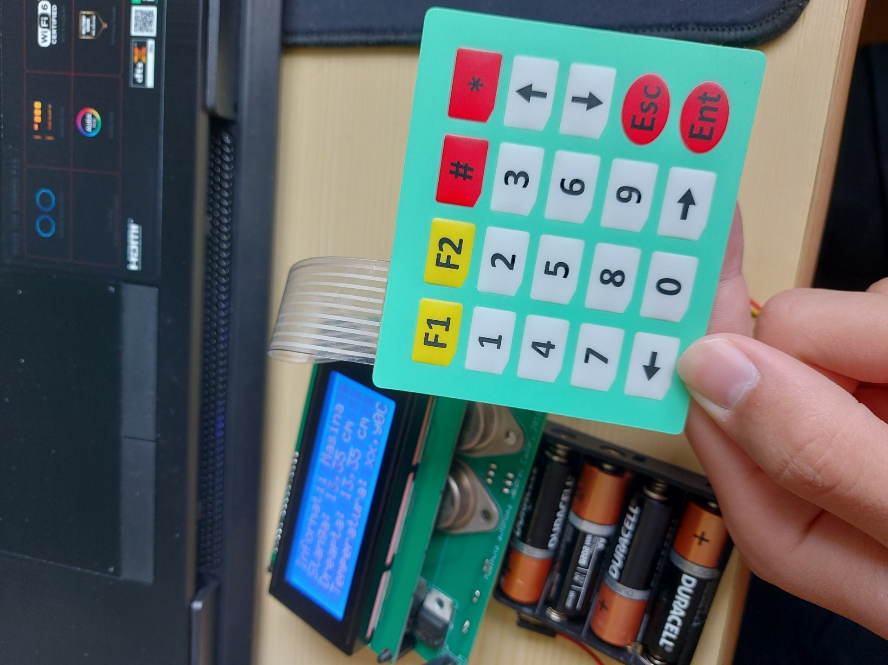
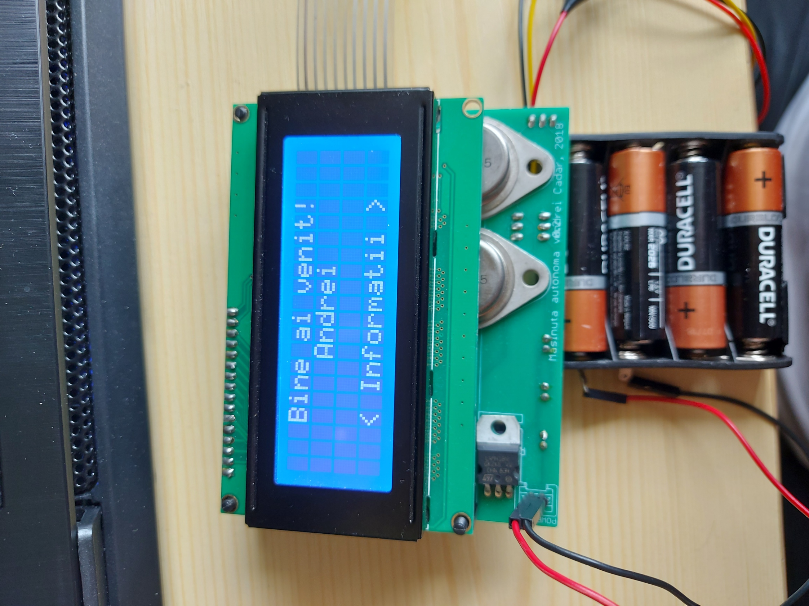
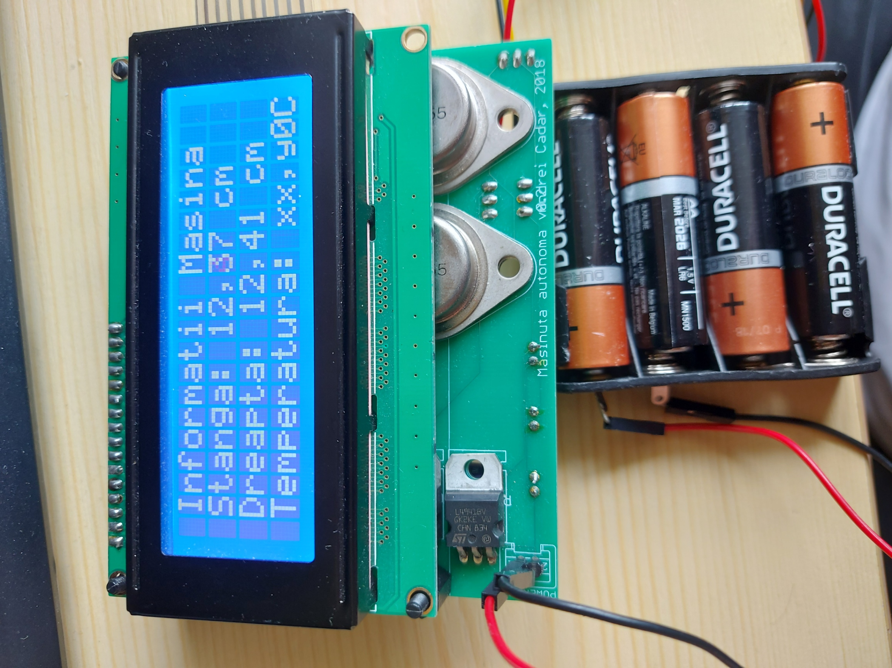
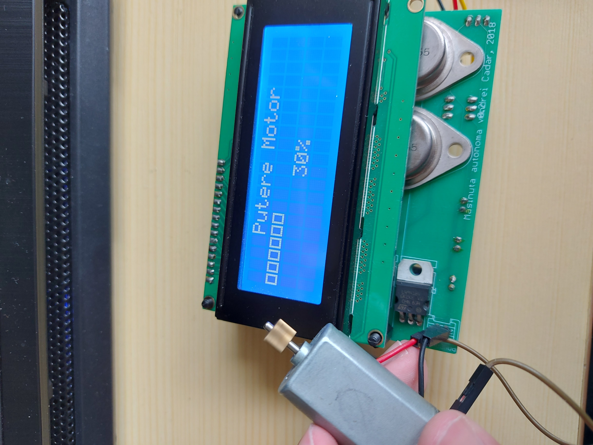

# ATMega32A-autonomous-car

Software for an autonomous car

## About

I have made this project with the help of an great person and engineer at Continental Frankfurt. The purpose was to make an autnomous car with two distance sensors(left and right) that avoids obstacles to continue its journey.
<br>
We started by learning the basics of microcontrollers and how to program them, and eventually completed this project. It was done in 2018.
<br>
I have learned a lot of C programming techniques, including operations on bits and also learned to separate the software into three layers, the [**lowest level layer**](Basic_SFWT/Basic_SFWT_Main.c), the [**hardware abstraction layer**](HAL/HAL_Main.c) and [**the application layer**](Aplicatie/Aplicatie_Main.c).



## Components

<ul>
    <li>ATMEGA32A</li>
    <li>20x4 LCD Display</li>
    <li>3.3 and 5V regulator</li>
    <li>Capacitors</li>
    <li>Rezistors</li>
    <li>NPN Tranzistors</li>
    <li>Potentiometers</li>
    <li>Custom made PCB</li>
    <li>Capacitors</li>
    <li>4x5 Keyboard</li>
    <li>Sharp distance sensors</li>
    <li>Electric motor</li>
    <li>16MHz oscilator</li>
    <li>Atmel ICE</li>
</ul>





## PCB

The PCB was custom made, to acomodate our needs, it has two layers.
<br>
Here is the [**schematic**](LogicSchematic.png) and the actual implementation on the [**PCB**](PCB.png)
<br>


## ATMEGA32A

This microcontroller is the key component, the brain of the project.
<br>
It has enough ADC pins for the three sensors and enough general purpose pins for the display and the keybaord.
<br>
Its frquency of 16MHz is more than enough for our project.

## Code

I found the process of writing the code for this project to be particularly interesting. As I had previous experience with C/C++ but never programmed a microcontroller before.
<br>

### Configuraion

In the configuration part I had to toggle certain bits of some register based on my needs.

```
    ICR1 = 2500;
	OCR1A = 187; // 125    187.5     250 (pozitii servo)
	OCR1B = 0;

	//TIMER 2
	TCCR2 = (1<<WGM21) + (1<<CS22) + (1<<CS21) + (1<<CS20); //prescaler 1024
	OCR2 = 156;

	TIMSK |= (1<<OCIE2);
	TIMSK |= (1<<OCIE0);

	//ADC

	ADCSRA = (0<<ADPS2) | (0<<ADPS0) | (1<<ADEN);
	ADCSRA |= ((1<<ADSC) + (1<<ADIE) + (1<<ADATE));
```

<br>
It was also interesting to set up an interrupt every aproximately 10ms.
```
ISR(TIMER2_COMP_vect)
{
    Task_10ms();
}
 ```

### Hardware Abstracion Layer

In this layer things like decoding the key pressed on the keyboard are processed.
<br>
A keyboard is a matrix of wires and a key is located at the intersaction of one vertical wire with a horizontal one. To determine the pressed key firstly we need to determine the column. We apply voltage at every line sequentially then check which column has voltage.

#### Column Verification

```
int determinare_coloana()
{

	if ((PINA & 0xF8) == 0b11110000)
	{
		return 0;
	}
	if ((PINA & 0b11111000) == 0b11101000)
	{
		return 1;
	}
	if ((PINA & 0b11111000) == 0b11011000)
	{
		return 2;
	}
	if ((PINA & 0b11111000) == 0b10111000)
	{
		return 3;
	}
	if ((PINA & 0b11111000) == 0b01111000)
	{
		return 4;
	}

	return 10;
}
```

#### Line Verification

```
if (verificare == 3)
	{
		PORTD = (PORTD | 0x0F) & (0x0F & 0x0B);
		colo = determinare_coloana();
		if (colo != 10)
			tasta = (char)a[colo][1];
		else
			tasta = 10;
	}

	if (verificare == 4)
	{
		PORTD = (PORTD | 0x0F) & (0x0F & 0x7);
		colo = determinare_coloana();
		if (colo != 10)
			tasta = (char)a[colo][0];
		else
			tasta = 10;
		verificare = 0;
	}

	verificare++;
```



<br>
<br>
The virtual screns of the display are defined here as well

```
LCD_Port_t STEP3_LCD[160];
unsigned char *Display_array;

unsigned char Display_array_empty[DISPLAY_MEMORY_SIZE] = "                                                                                ";
/*                                                       0123456789ABCDEFGHIJ0123456789ABCDEFGHIJ0123456789ABCDEFGHIJ0123456789ABCDEFGHIJ*/
/*                                              Row      11111111111111111111333333333333333333332222222222222222222244444444444444444444*/

unsigned char Display_array_0[DISPLAY_MEMORY_SIZE] = "   Masina Autonoma                                                    v2.0 2019 ";
/*                                                       0123456789ABCDEFGHIJ0123456789ABCDEFGHIJ0123456789ABCDEFGHIJ0123456789ABCDEFGHIJ*/
/*                                              Row      11111111111111111111333333333333333333332222222222222222222244444444444444444444*/

unsigned char Display_array_1[DISPLAY_MEMORY_SIZE] = "   Bine ai venit!                              Andrei          < Informatii >    ";
/*                                                       0123456789ABCDEFGHIJ0123456789ABCDEFGHIJ0123456789ABCDEFGHIJ0123456789ABCDEFGHIJ*/
/*                                              Row      11111111111111111111333333333333333333332222222222222222222244444444444444444444*/

unsigned char Display_array_2[DISPLAY_MEMORY_SIZE] = " Informatii Masina   Dreapta: xx,yy cm   Stanga: xx,yy cm    Temperatura: xx,y0C ";
/*                                                       0123456789ABCDEFGHIJ0123456789ABCDEFGHIJ0123456789ABCDEFGHIJ0123456789ABCDEFGHIJ*/
/*                                              Row      11111111111111111111333333333333333333332222222222222222222244444444444444444444*/

unsigned char Display_array_3[DISPLAY_MEMORY_SIZE] = "    Putere Motor             xx%                                                ";
/*                                                       0123456789ABCDEFGHIJ0123456789ABCDEFGHIJ0123456789ABCDEFGHIJ0123456789ABCDEFGHIJ*/
/*                                              Row      11111111111111111111333333333333333333332222222222222222222244444444444444444444*/
```



<br>
Also the analog to digital conversion is done here

```
void conversie_in_distanta()
{
	voltaj1 = ((double)senzor1 * 5) / 1024;
	voltaj2 = ((double)senzor2 * 5) / 1024;
	distanta1 = 0;
	distanta2 = 0;

	int i = 1;
	while (voltaj[i] > voltaj1 && i < sizeof(voltaj))
		i++;
	distanta1 = ((distanta[i - 1] - distanta[i]) / (voltaj[i - 1] - voltaj[i])) * (voltaj1 - voltaj[i]) + distanta[i];

	i = 1;
	while (voltaj[i] > voltaj2 && i < sizeof(voltaj))
		i++;
	distanta2 = ((distanta[i - 1] - distanta[i]) / (voltaj[i - 1] - voltaj[i])) * (voltaj2 - voltaj[i]) + distanta[i];

	iteratie++;
}
```

<br>
Writing on a display may seem easy, but a lot of things must be done before displaying something.
<br>
The displays has special commands like moving the cursor or erasing everything on the display, these must be configured differently than writing a character.

```
void send_a_command(unsigned char command)
{
	ctrl_port = (1 << E) | (0 << RS) | (0 << RW);
	_delay_us(10);

	other_port = command;
	_delay_ms(2);
	ctrl_port = (0 << E) | (0 << RS) | (0 << RW);
	_delay_us(10);
}

void send_a_character(unsigned char character)
{
	ctrl_port = (1 << RS) | (1 << E);
	_delay_us(10);
	other_port = character;
	_delay_us(20);
	ctrl_port = (0 << RS) | (0 << E);
	_delay_us(10);
}
```

### Application

This layer is the easiest to understand. Thanks to the other two layers here we feel like home, we work with numbers and arrays and no more bits operations.
<br>
For example this is how we print the distances on the screen

```
  void display_informatii()
  {
	   int cp2distanta1 = (int)(distanta1);

	   Display_array[dreapta_zeci]=(cp2distanta1/10+'0');
	   Display_array[dreapta_unitati]=(cp2distanta1%10+'0');
	   int cpdistanta1 = (int)(distanta1*100);
	   Display_array[dreapta_zecimi]=((cpdistanta1/10)%10+'0');
	   Display_array[dreapta_sutimi]=(cpdistanta1%10+'0');

	   int cp2distanta2 = (int)(distanta2);

	   Display_array[stanga_zeci]=(cp2distanta2/10+'0');
	   Display_array[stanga_unitati]=(cp2distanta2%10+'0');
	   int cpdistanta2 = (int)(distanta2*100);
	   Display_array[stanga_zecimi]=((cpdistanta2/10)%10+'0');
	   Display_array[stanga_sutimi]=(cpdistanta2%10+'0');

  }
```



<br>
Here is where we also switch between multiple displays. We use the left and right arrows to navigate between multiple menus on the display.

```
switch (MMI_State_Machine)
	  {
			case MMI_SCREEN1:
				Display_array=Display_array_0;
				if(counter>(2*logo_time)/3)
					{
						Display_array=Display_array_empty;
						if(counter>logo_time)
							MMI_State_Machine=MMI_SCREEN2;
					}

				counter++;
				break;


			case MMI_SCREEN2:
				Display_array = Display_array_1;

					tasta = verificare_tasta();
```

<br>
One of the menus is for testing the the motor. Using the up and down keyboard keys we can set the engine power in increments of 10%.


